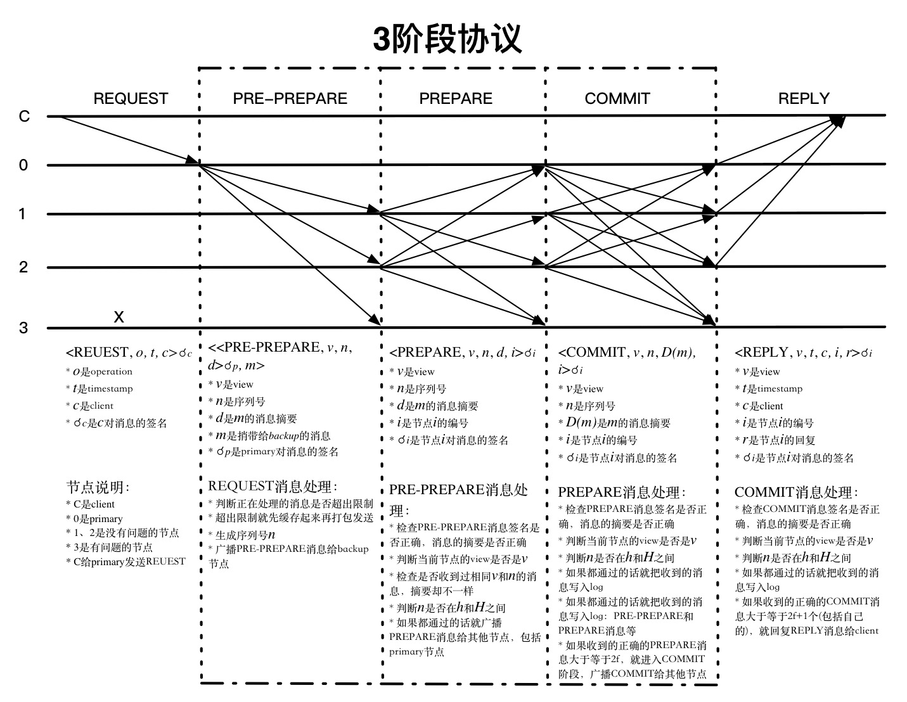
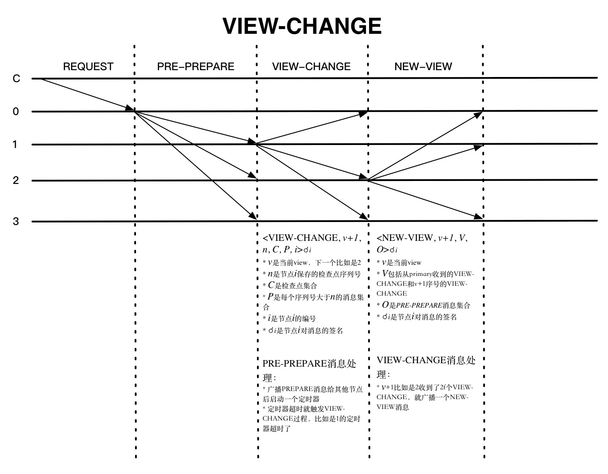

# PBFT 算法
## raft和pbft的最大容错节点数  
**pbft 算法的最大容错节点数量是（n-1）/3**

**raft 算法的最大容错节点数量是（n-1）/2**

对于 pbft 算法，因为pbft算法的除了需要支持容错故障节点之外，还需要支持容错作恶节点。假设集群节点数为 N，有问题的节点为 f。  
有问题的节点中，可以既是故障节点，也可以是作恶节点，或者只是故障节点或者只是作恶节点.
- 第一种情况，f 个有问题节点既是故障节点，又是作恶节点，那么根据小数服从多数的原则，集群里正常节点只需要比f个节点再多一个节点，即 f+1 个节点，确节点的数量就会比故障节点数量多，那么集群就能达成共识。也就是说这种情况支持的最大容错节点数量是 （n-1）/2。
- 第二种情况，故障节点和作恶节点都是不同的节点。那么就会有 f 个问题节点和 f 个故障节点，当发现节点是问题节点后，会被集群排除在外，剩下 f 个故障节点，那么根据小数服从多数的原则，集群里正常节点只需要比f个节点再多一个节点，即 f+1 个节点，确节点的数量就会比故障节点数量多，那么集群就能达成共识。所以，所有类型的节点数量加起来就是 f+1 个正确节点，f个故障节点和f个问题节点，即 3f+1=n。


## 算法基本流程
### 流程
pbft 算法的基本流程主要有以下四步：

- 客户端发送请求给主节点

- 主节点广播请求给其它节点，节点执行 pbft 算法的三阶段共识流程。
- 节点处理完三阶段流程后，返回消息给客户端。
- 客户端收到来自 f+1 个节点的相同消息后，代表共识已经正确完成。


### 三阶段流程



- client：发出调用请求的实体
- view：连续的编号
- replica：网络节点
- primary：主节点，负责生成消息序列号
- backup：支撑节点
- state：节点状态

从primary收到消息开始，每个消息都会有view的编号，每个节点都会检查是否和自己的view是相同的，代表是哪个节点发送出来的消息，源头在哪里，client收到消息也会检查该请求返回的所有消息是否是相同的view。如果过程中发现view不相同，消息就不会被处理。除了检查view之外，每个节点收到消息的时候都会检查对应的序列号n是否匹配，还会检查相同view和n的PRE-PREPARE、PREPARE消息是否匹配，从协议的连续性上提供了一定程度的安全。

每个节点收到其他节点发送的消息，能够验证其签名确认发送来源，但并不能确认发送节点是否伪造了消息，PBFT采用的办法就是数数，看有多少节点发送了相同的消息，在有问题的节点数有限的情况下，就能判断哪些节点发送的消息是真实的。**REQUEST和PRE-PREPARE阶段还不涉及到消息的真实性，只是独立的生成或者确认view和序列号n，所以收到消息判断来源后就广播出去了。PREPARE阶段开始会汇总消息，通过数数判断消息的真实性。**

**PREPARE消息是收到PRE-PREPARE消息的节点发送出来的，primary收到REQUEST消息后不会给自己发送PRE-PREPARE消息，也不会发送PREPARE消息**，所以一个节点收到的消息数满足**2f+1-1=2f**个就能满足没问题的节点数比有问题节点多了（包括自身节点）。COMMIT阶段primary节点也会在收到PREPARE消息后发送COMMIT消息，所以收到的消息数满足2f+1个就能满足没问题的节点数比有问题节点多了（包括自身节点）。

PRE-PREPARE和PREPARE阶段保证了所有正常的节点对请求的处理顺序达成一致，它能够保证如果`PREPARE(m, v, n, i) `是真的话，`PREPARE(m’, v, n, j)` 就一定是假的，其中j是任意一个正常节点的编号，只要`D(m) != D(m’)`。因为如果有3f+1个节点，至少有f+1个正常的节点发送了PRE-PREPARE和PREPARE消息，所以如果`PREPARE(m’, v, n, j)` 是真的话，这些节点中就至少有一个节点发了不同的PRE-PREPARE或者PREPARE消息，这和它是正常的节点不一致。当然，还有一个假设是安全强度是足够的，能够保证m != m’时，D(m) != D(m’)，D(m) 是消息m的摘要。

确定好了每个请求的处理顺序，怎么能保证按照顺序执行呢？网络消息都是无序到达的，每个节点达成一致的顺序也是不一样的，有可能在某个节点上n比n-1先达成一致。其实每个节点都会把PRE-PREPARE、PREPARE和COMMIT消息缓存起来，它们都会有一个状态来标识现在处理的情况，然后再按顺序处理。而且序列号n在不同view中也是连续的，所以n-1处理完了，处理n就好了。

#### 客户端 C 向主节点发起请求，主节点 0 收到客户端请求

```math
<Request,o,t,c>σc 
```
- σc 是client 对请求消息的签名
- o  是operation
- c  是client


#### Pre-prepare 阶段

主节点收到`<Request,o,t,c>σc `之后，生成序列号 n ，广播`Pre-prepare`消息

```math
<<Pre-Prepare,v,n,d>σp,m>
```
- v  是view
- d  是消息的摘要
- n  是序列号
- σp 是primary 对消息的签名
- m  是发给backup节点的消息

节点收到 pre-prepare消息后，会有两种选择，一种是接受，一种是不接受。什么时候才不接受主节点发来的 pre-prepare 消息呢？一种典型的情况就是如果一个节点接受到了一条 pre-prepare 消息，消息里的 v 和 n 在之前收到里的消息是曾经出现过的，但是 d 和 m 却和之前的消息不一致，或者请求编号不在高低水位之间，这时候就会拒绝请求。**拒绝的逻辑就是主节点不会发送两条具有相同的 v 和 n ，但 d 和 m 却不同的消息。**


#### Prepare 阶段
节点验证只要没有问题，就发送 prepare 消息（不涉及消息的真实性）  

节点同意请求后会向其它节点发送 prepare 消息。这里要注意一点，同一时刻不是只有一个节点在进行这个过程，可能有 n 个节点也在进行这个过程。因此节点是有可能收到其它节点发送的 prepare 消息的。
```math
<Prepare,v,n,d,i>σi
```
- i  是节点 i 的编号
- σi 是节点 i 对 prepare 消息的签名

节点收到了 prepare 消息之后，先判断v,n等数据签名没问题，如果没问题，就把收到的消息写入log,包括（pre-prepare,prepare消息）

在一定时间范围内，如果收到超过 2f 个不同节点的 prepare 消息，就代表 prepare 阶段已经完成。


#### Commit 阶段

节点进入 commit 阶段。向其它节点广播 commit 消息，同理，这个过程可能是有 n 个节点也在进行的。因此可能会收到其它节点发过来的 commit 消息。
```math
<Commit,v,n,D(m),i>σi
```
- D(m)  是 m 的信息摘要

当收到 2f+1 个 commit 消息后（包括自己），代表大多数节点已经进入 commit 阶段，这一阶段已经达成共识，于是节点就会执行请求，写入数据。

### Reply
节点达成共识，会回复Reply 消息给 client
```math
<Reply,v,t,c,i,r>σi
```
- v  是 view
- t 是时间戳
- r 是节点 i 的回复
- σi 是节点对 Reply 消息的签名


所有的流程如上图所示


### ViewChange（视图更改）事件
当主节点挂了（超时无响应）或者从节点集体认为主节点是问题节点时，就会触发 ViewChange 事件， ViewChange 完成后，视图编号将会加 1 。



viewchange 会有三个阶段，分别是 view-change ， view-change-ack 和 new-view 阶段。从节点认为主节点有问题时，会向其它节点发送 view-change 消息，当前存活的节点编号最小的节点将成为新的主节点。  
```math
 <View-Change,v+1,C,P,Q,i>
```
-  h 是节点 i 的最新 stable checkpoin
-  C 是每个 checkpoint <序号, digest> 的集合
-  集合 P 存储了之前 view 中到达 prepared 状态的请求。数据结构为  `<n,d,v>` 意为节点 i 收集到 view v 中序号为 n，digest 为 d 的请求的 prepared certificate，并且节点 i 上的下一个 view 中就不能有相同序号的prepare请求。
-  集合 Q 存储了之前 view 中到达 pre-prepared 状态，数据结构为<n,d,v> 意为 i 已经 pre-prepare 了一个请求并且在下一 view 中这个请求没有相同序号的 pre-prepare请求。

副本收集 VIEW-CHANGE 消息后发送 acknowledgments 以达成切换到 v+1 的共识
```math
<View-Change-ACK,v+1,i,j,d> 
```
其中 i 是发送者的标识，d 是acknowledged VIEW-CHANGE message 的 digest，j 是发送 VIEW-CHANGE 消息的节点。

当新的主节点收到 2f 个其它节点的 view-change 消息，则证明有足够多人的节点认为主节点有问题，于是就会向其它节点广播 New-view 消息  


对于主节点，发送 new-view 消息后会继续执行上个视图未处理完的请求，从 pre-prepare 阶段开始。其它节点验证 new-view 消息通过后，就会处理主节点发来的 pre-prepare 消息，这时执行的过程就是前面描述的 pbft 过程。到这时，正式进入 v+1 （视图编号加1）的时代了。


上图是发生VIEW-CHANGE的一种情况，就是节点正常收到PRE-PREPARE消息以后都会启动一个定时器，如果在设置的时间内都没有收到回复，就会触发VIEW-CHANGE，该节点就不会再接收除CHECKPOINT 、VIEW-CHANGE和NEW-VIEW等消息外的其他消息了。NEW-VIEW是由新一轮的primary节点发送的，O是不包含捎带的REQUEST的PRE-PREPARE消息集合，计算方法如下：

primary节点确定V中最新的稳定检查点序列号min-s和PRE-PREPARE消息中最大的序列号max-s
对min-s和max-s之间每个序列号n都生成一个PRE-PREPARE消息。这可能有两种情况：
P的VIEW-CHANGE消息中至少存在一个集合，序列号是n
不存在上面的集合
第一种情况，会生成新的PRE-PREPARE消息
```math
<PRE-PREPARE, v+1, n, d>
```


### 高低水位(处理垃圾回收)
- checkpoint 就是当前节点处理的最新请求序号。
- stable checkpoint 就是大部分节点 （2f+1） 已经共识完成的最大请求序号。  
  比如系统有 4 个节点，三个节点都已经共识完了的请求编号是 213 ，那么这个 213 就是 stable checkpoint 了。

为了不保留过去的所有preprepare, prepare以及commit等log信息，所以我们每个一段时间设立一个检查点，这个检查点需要得到全网的共识。这个经过全网共识的检查点被称为stable checkpoint。在stable checkpoint前面的所有log信息就可以删除。

**stable checkpoint 最大的目的就是减少内存的占用。**

对于每个共识结点每K个请求，就设立一个checkpoint，但由于每个共识结点共识过程是异步的，所以可能结点1刚刚处理了请求1，但结点2已经处理了请求k，此时结点2设立`checkpoint_1`，并广播出去（告诉大家我已经到K了，K时候的状态是这样的）。此时，结点2也不会等其他结点（如结点1）返回同样的`checkpoint_1`信息再继续处理请求。结点2一直向前处理交易，比如处理了2K个交易后，他设立另一个`checkpoint_2`并广播出去。

结点2是不能一直狂奔的，这涉及到高低水位。因为如果主节点是坏的，它在给请求编号时故意选择了一个很大的编号，以至于超出了序号的范围，所以我们需要设置一个低水位（low water mark）h和高水位（high water mark）H，让主节点分配的编号在h和H之间，不能肆意分配。

```
低水位：h
高水位：H
间隔：L
即：H=h+L
```
如果我们的间隔设为2倍的K，低水位为最新的`stable checkpoint_0`，其为0；高水位为`0+2K=2K`；现在结点2已经狂奔到2K了，他不能向前了，所以他只能等待低水位L的前进，即他等到了2f个`checkpoint_1`的确认信息。此时，L会先前移动为`stable_checkpoint_1`，其为K；高水位变成3K，结点2可以继续前进了。


### 参考如下：
[PBFT](https://www.iteye.com/blog/aoyouzi-2426360)

[共识算法系列之一：raft和pbft算法](https://zhuanlan.zhihu.com/p/35847127)