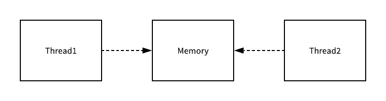
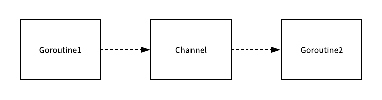

# 协程并发
### 通信

- 线程。    **共享内存的方式进行通信**

  

- 协程。   **通过通信的方式共享内存**

  `Channel `就是用于传递信息的通道，使用 CSP 并发模型的 `Goroutine` 就会通过 `Channel `来传递消息。



一个会负责向 `Channel `中发送消息，另一个会负责从` Channel `中接收消息，它们两者并没有任何直接的关联，能够独立地工作和运行，但是间接地通过 `Channel `完成了通信。

### channel

#### 1、数据结构

```go
type hchan struct {
    qcount   uint  // 保存了当前 Channel 中的元素个数
    dataqsiz uint  // 表示 Channel 中的循环队列的长度
    buf      unsafe.Pointer  // 指向了一个长度为 dataqsiz 的数组
    elemsize uint16
    closed   uint32
    elemtype *_type
    sendx    uint   //负责标识当前 Channel 的发送已经处理到了数组中的哪个位置。
    recvx    uint   //负责标识当前 Channel 的接收已经处理到了数组中的哪个位置。
    recvq    waitq
    sendq    waitq
    lock mutex
}
```

### 2 、基本操作

```go
ch := make(chan int, 1)
ch <- 1
<-ch
close(ch)
```


