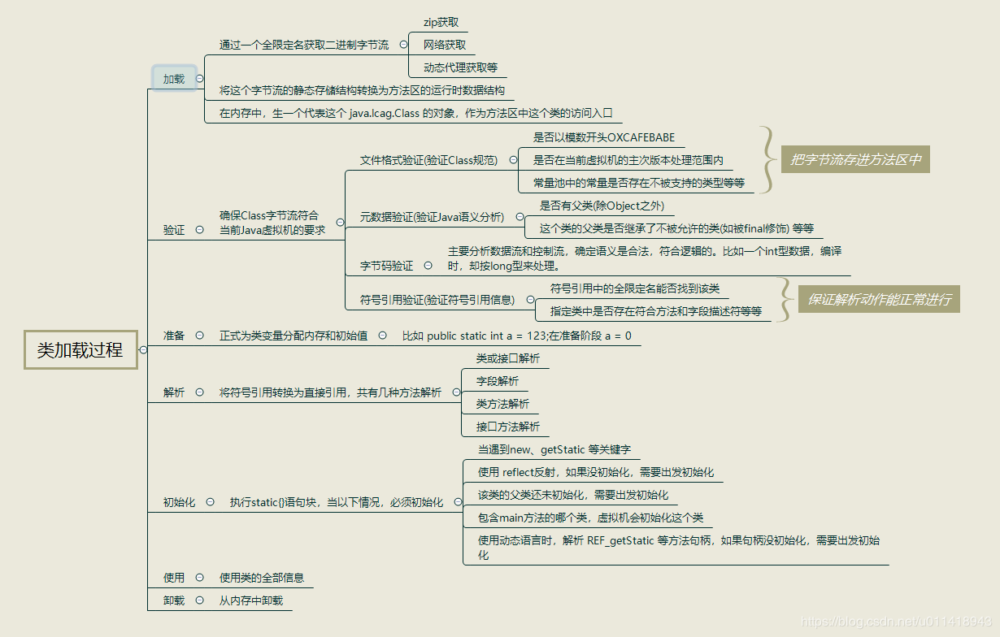

# 类加载过程

### 类的初始化

 初始化，为类的静态变量赋予正确的初始值，JVM负责对类进行初始化，主要对类变量进行初始化。在Java中对类变量进行初始值设定有两种方式：

- ①声明类变量时指定初始值

- ②使用静态代码块为类变量指定初始值

##### JVM初始化步骤

- 1、假如这个类还没有被加载和连接，则程序先加载并连接该类

- 2、假如该类的直接父类还没有被初始化，则先初始化其直接父类

- 3、假如类中有初始化语句，则系统依次执行这些初始化语句

##### 初始化阶段时执行类构造器方法()的过程。

- 1、 类构造器方法是由编译器自动收集类中的所有类变量的赋值动作和静态语句块（static{}块）中的语句合并产生的，编译器收集的顺序由语句在源文件中出现的顺序所决定。

- 2、类构造器方法与类的构造函数不同，它不需要显式地调用父类构造器，虚拟机会保证在子类的类构造器方法执行之前，父类的类构造器方法已经执行完毕，因此在虚拟机中第一个执行的类构造器方法的类一定是java.lang.Object。

- 3、由于父类的类构造器方法方法先执行，也就意味着**父类中定义的静态语句块要优先于子类的变量赋值操作**。

- 4、类构造器方法对于类或者接口来说并不是必需的，如果一个类中没有静态语句块也没有对变量的赋值操作，那么编译器可以不为这个类生成类构造器方法。

- 5、接口中可能会有变量赋值操作，因此接口也会生成类构造器方法。但是接口与类不同，执行接口的类构造器方法不需要先执行父接口的类构造器方法。只有当父接口中定义的变量被使用时，父接口才会被初始化。另外，接口的实现类在初始化时也不会执行接口的类构造器方法。

- 6、虚拟机会保证一个类的类构造器方法在多线程环境中被正确地加锁和同步。如果有多个线程去同时初始化一个类，那么只会有一个线程去执行这个类的类构造器方法，其它线程都需要阻塞等待，直到活动线程执行类构造器方法完毕。如果在一个类的类构造器方法中有耗时很长的操作，那么就可能造成多个进程阻塞。

于初始化阶段虚拟机规范是严格规定了如下几种情况，如果类未初始化会对类进行初始化。

### 参考

[深入Java虚拟机](https://juejin.im/post/5ccfa05af265da039f0f243b#heading-11)

[Java类加载机制（全套）](https://juejin.im/post/5a810b0e5188257a5c606a85)