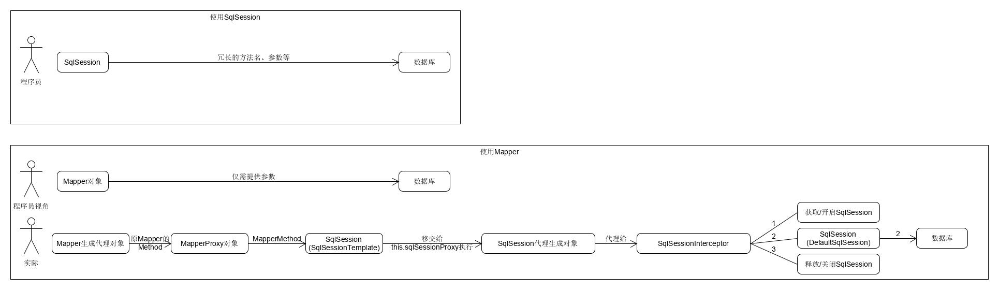

## Mybatis 深入学习

### Mybatis 执行步骤

#### Mybatis 只做了两件事情：

- 根据 JDBC 规范 建立与数据库的连接。
- 通过反射打通Java对象和数据库参数和返回值之间相互转化的关系。

#### Mybatis  的运行过程

- 第一部分是读取配置文件创建 `Configuration`对象, 用以创建` SqlSessionFactroy`

- 第二部分是 `SQLSession` 的执行过程.

#### 常见类

- 1、`SqlSessionaFactoryBuilder`  该类主要用于创建 `SqlSessionFactory`, 并给与一个流对象, 该类使用了创建者模式, 如果是手动创建该类(这种方式很少了), 那么建议在创建完毕之后立即销毁.

- 2、`SqlSessionFactory` 该类的作用了创建 `SqlSession`, 从名字上我们也能看出, 该类使用了工厂模式, 每次应用程序访问数据库, 我们就要通过 `SqlSessionFactory `创建 `SqlSession`, 所以`SqlSessionFactory` 和整个 `Mybatis` 的生命周期是相同的. 这也告诉我们不要创建多个同一个数据的 `SqlSessionFactory`, 如果创建多个, 会消耗尽数据库的连接资源, 导致服务器夯机. 应当使用单例模式. 避免过多的连接被消耗, 也方便管理.
- 3、`SqlSession`  那么是什么 `SqlSession` 呢? `SqlSession` 相当于一个会话, 就像 HTTP 请求中的会话一样, 每次访问数据库都需要这样一个会话, 大家可能会想起了 JDBC 中的 `Connection`, 很类似,但还是有区别的, 何况现在几乎所有的连接都是使用的连接池技术, 用完后直接归还而不会像 `Session` 一样销毁. 注意:他是一个线程不安全的对象, 在设计多线程的时候我们需要特别的当心, 操作数据库需要注意其隔离级别, 数据库锁等高级特性, 此外, 每次创建的 `SqlSession` 都必须及时关闭它, 它长期存在就会使数据库连接池的活动资源减少,对系统性能的影响很大, 我们一般在 `finally` 块中将其关闭. 还有, `SqlSession` 存活于一个应用的请求和操作,可以执行多条`Sql`, 保证事务的一致性.

- 4、`Mapper` 映射器， 正如我们编写的那样, `Mapper`是一个接口, 没有任何实现类, 他的作用是发送 `SQL`, 然后返回我们需要的结果. 或者执行` SQL `从而更改数据库的数据, 因此它应该在 `SqlSession` 的事务方法之内, 在 `Spring` 管理的` Bean` 中, `Mapper `是单例的。

#### @mapperScan

- 1、`@MapperScan`扫描指定的包，对每个`Mapper`，以它的名字注册了实际类型是`MapperFactoryBean`的Bean定义。

- 2、有了这些`Bean`定义，在`spring`实例化`Bean`时，这些`MapperFactoryBean`会被实例化、初始化，对应的方法也会设置

- 3、在处理`@autowired`标注的`Mapper`时，会返回`MapperFactoryBean.getObject`的调用结果,也就是`getSqlSession().getMapper(this.mapperInterface);`了。

- 4、上一步的结果会导致`@Autowired SomeMapper mapper;`上注入了一个Mapper代理类，该代理类会将所有数据库请求都移交给底层的SqlSession操作。

- 5、上一步中，`Mapper`移交到的`sqlSession`其实是个`SqlSessionTemplate`，`SqlSessionTemplate`又将一切数据库操作移交给`sqlSessionProxy`，而后者是基于`SqlSessionIntercepto`r创建的代理类。
   也就是说，`SqlSessionTemplate`的数据库操作会被`SqlSessionInterceptor.invoke`所拦截。

- 6、`SqlSessionInterceptor.invoke`中调用`getSqlSession`方法，其内部在需要的时候调用`session = sessionFactory.openSession(executorType);`获取新的`session`，其实也就在开启新的连接。
   也就是说`SqlSessionTemplate`的数据库操作会被`SqlSessionInterceptor.invoke`所拦截，每次操作前都要获取到`SqlSession`(实际类型是`DefaultSqlSession`)，这个`SqlSession`：要么是复用现有的(比如复用当前事务使用的)，要么是新建的。

###  深入Mybatis

#### Executor执行器

`Mybatis`有三种基本的`Executor`执行器，`SimpleExecutor`、`ReuseExecutor`、`BatchExecutor`。

- `SimpleExecutor`：每执行一次`update`或`select`，就开启一个`Statement`对象，用完立刻关闭`Statement`对象。

- `ReuseExecutor`：执行`update`或`select`，以sql作为key查找`Statement`对象，存在就使用，不存在就创建，用完后，不关闭`Statement`对象，而是放置于`Map<String, Statement>`内，供下一次使用。简言之，就是重复使用`Statement`对象。

- `BatchExecutor`：执行`update`（没有`select`，JDBC批处理不支持`select`），将所有sql都添加到批处理中（`addBatch()`），等待统一执行（`executeBatch()`），它缓存了多个`Statement`对象，每个`Statement`对象都是`addBatch()`完毕后，等待逐一执行`executeBatch()`批处理。与JDBC批处理相同。

Executor的这些特点，都严格限制在SqlSession生命周期范围内。

### 参考如下：

[mybatis mapper解析(下) @mapperScan](https://www.jianshu.com/p/97bbfbeaa68b)

[深入剖析 mybatis 原理（一）]