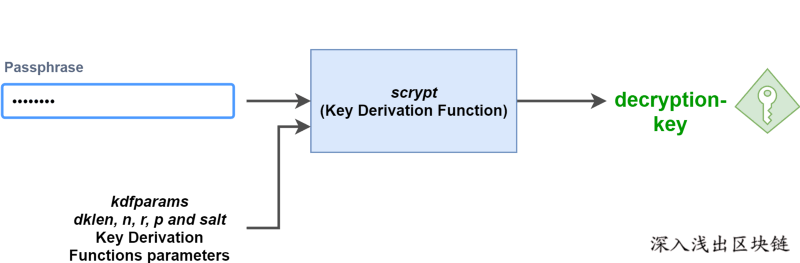
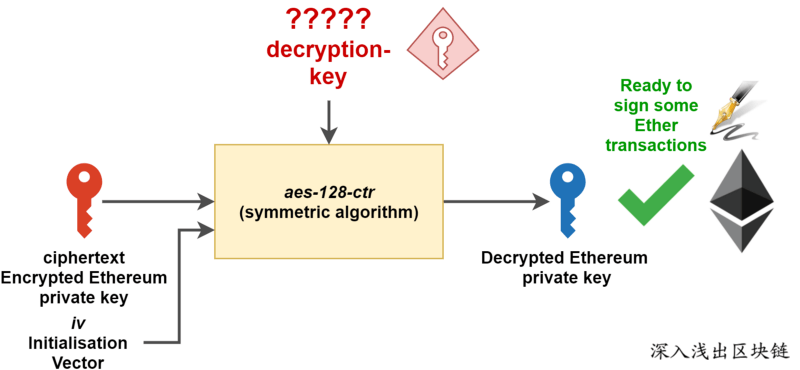
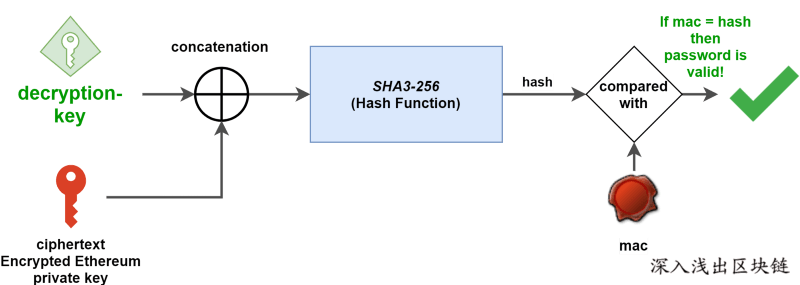

# 钱包常用知识

## 钱包登录

- 单链钱包：只支持一条链的钱包，比方说比特币钱包。  
- 多链钱包：支持所有币种的钱包。  
- 单账户钱包：每种币只支持一个账户。  
- 多账户钱包：每种币支持多个账户  

钱包登录的方案三种：

类别 |效果
---|---
助记词 | 可设置新的密码，与原来不冲突
keystore + 钱包密码|须保存相对应的密码
  私钥 |

## 钱包密码
可用于转账确认，调用合约等，以及辅助keystore登录

## 助记词
私钥是64位长度的十六进制的字符，不利于记录且容易记错，且每个账号对应一个私钥，多个账号就有多个私钥，不易管理，所以用算法将一串随机数转化为了一串12 ~ 24个容易记住的单词，方便保存记录。      


**通过助记词可以获取相关联的多个私钥，但是通过其中一个私钥是不能获取助记词的，因此助记词≠私钥。**


根据助记词推算种子的算法是**PBKDF2**，使用的哈希函数是Hmac-SHA512，其中，输入是助记词的UTF-8编码，并设置Key为mnemonic+password，循环2048次，得到最终的64字节种子。


## KeyStore

```
{  
   "address":"856e604698f79cef417aab...",
   "crypto":{  
      "cipher":"aes-128-ctr",
      "ciphertext":"13a3ad2135bef1ff228e399dfc8d7757eb4bb1a81d1b31....",
      "cipherparams":{  
         "iv":"92e7468e8625653f85322fb3c..."
      },
      "kdf":"scrypt",
      "kdfparams":{  
         "dklen":32,
         "n":262144,
         "p":1,
         "r":8,
         "salt":"3ca198ce53513ce01bd651aee54b16b6a...."
      },
      "mac":"10423d837830594c18a91097d09b7f2316..."
   },
   "id":"5346bac5-0a6f-4ac6-baba-e2f3ad464f3f",
   "version":3
}
```
- address: 账号地址
- version: Keystore 文件的版本，目前为第 3 版，也称为 V3 KeyStore。
- salt 是一段随机的盐
- dk_len 是输出的哈希值的长度
- n 是 CPU/Memory 开销值，越高的开销值，计算就越困难。
- r 表示块大小
- p 表示并行度。
- id : uuid
- crypto: 加密推倒的相关配置:  
  1. cipher 是用于加密以太坊私钥的对称加密算法。用的是 aes-128-ctr 。
  2. cipherparams 是 aes-128-ctr加密算法需要的参数。在这里，用到的唯一的参数 iv。
  3. ciphertext 是加密算法输出的密文，也是将来解密时的需要的输入。
  4. kdf: 指定使用哪一个算法，这里使用的是 scrypt。
  5. kdfparams: scrypt 函数需要的参数
  6. mac: 用来校验密码的正确性， mac= sha3 (DK [16:32], ciphertext)

#### Keystore 文件的产生：

- 1、使用 scrypt 函数 （根据密码 和 相应的参数） 生成秘钥
- 2、使用上一步生成的秘钥 + 账号私钥 + 参数 进行对称加密。
- 3、把相关的参数 和 输出的密文 保存为以上格式的 JSON 文件


####  整体流程


##### 在 Keystore 中，是用的是 [Scrypt 算法](https://tools.ietf.org/html/rfc7914)，用一个公式来表示的话，派生的 Key 生成方程为：

```
DK = Scrypt(salt, dk_len, n, r, p)
```




#### 校验Keystore

当我们在使用 Keystore 文件来还原私钥时，依然是使用 kdf 生成一个秘钥，然后用秘钥对 ciphertext 进行解密，其过程如下：




无论使用说明密码，来进行这个操作，都会生成一个私钥，但是最终计算的以太坊私钥到底是不是正确的，却不得而知。

这就是 keystore 文件中 mac 值的作用。**mac 值是 kdf 输出 和 ciphertext 密文进行 SHA3-256 运算的结果，显然密码不同，计算的 mac 值也不同**，因此可以用来检验密码的正确性。




参考信息

[账号 Keystore 文件导入导出](https://learnblockchain.cn/2018/10/25/eth-web-wallet_2/)  
[精通比特币-钱包](https://github.com/tianmingyun/MasterBitcoin2CN/blob/master/ch05.md)