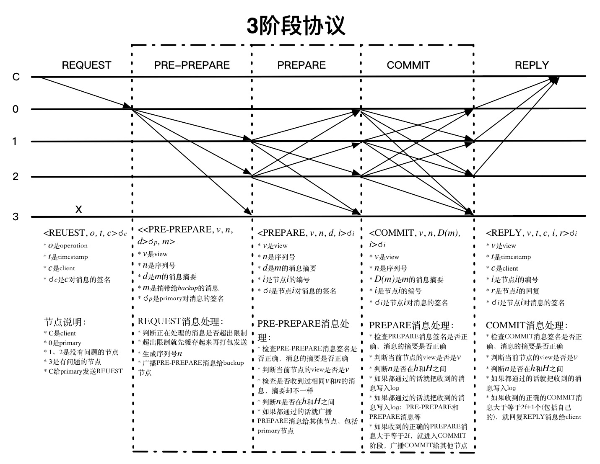

# ACID 原则与多阶段算法

## ACID 原则

具体来说，ACID 原则描述了分布式数据库需要满足的一致性需求，同时允许付出可用性的代价。

- Atomicity(原子性)：每次事务是原子的，事务包含的所有操作要么全部成功，要么全部不执行。一旦有操作失败，则需要回退状态到执行事务之前；

- Consistency（一致性）：数据库的状态在事务执行前后的状态是一致的和完整的，无中间状态。即只能处于成功事务提交后的状态；

- Isolation（隔离性）：各种事务可以并发执行，但彼此之间互相不影响。按照标准 SQL 规范，从弱到强可以分为未授权读取、授权读取、可重复读取和串行化四种隔离等级；

- Durability（持久性）：状态的改变是持久的，不会失效。一旦某个事务提交，则它造成的状态变更就是永久性的。

  

## 两阶段提交算法（Two-phase Commit，2PC）

其基本思想十分简单，既然在分布式场景下，直接提交事务可能出现各种故障和冲突，那么可将其分解为预提交和正式提交两个阶段，规避冲突的风险。

- 预提交：协调者（Coordinator）发起提交某个事务的申请，各参与执行者（Participant）需要尝试进行提交并反馈是否能完成；
- 正式提交：协调者如果得到所有执行者的成功答复，则发出正式提交请求。如果成功完成，则算法执行成功。

在此过程中任何步骤出现问题（例如预提交阶段有执行者回复预计无法完成提交），则需要回退。

两阶段提交算法因为其简单容易实现的优点，在关系型数据库等系统中被广泛应用。当然，其缺点也很明显。整个过程需要同步阻塞导致性能一般较差；同时存在单点问题，较坏情况下可能一直无法完成提交；另外可能产生数据不一致的情况（例如协调者和执行者在第二个阶段出现故障）。

## 三阶段提交算法（Three-phase Commit，3PC）。

三阶段提交针对两阶段提交算法第一阶段中可能阻塞部分执行者的情况进行了优化。具体来说，将预提交阶段进一步拆成两个步骤：尝试预提交和预提交。

完整过程如下：

- 尝试预提交：协调者询问执行者是否能进行某个事务的提交。执行者需要返回答复，但无需执行提交。这就避免出现部分执行者被无效阻塞住的情况。
- 预提交：协调者检查收集到的答复，如果全部为真，则发起提交事务请求。各参与执行者（Participant）需要尝试进行提交并反馈是否能完成；
- 正式提交：协调者如果得到所有执行者的成功答复，则发出正式提交请求。如果成功完成，则算法执行成功。

其实，无论两阶段还是三阶段提交，都只是一定程度上缓解了提交冲突的问题，并无法一定保证系统的一致性。首个有效的算法是后来提出的 Paxos 算法。

