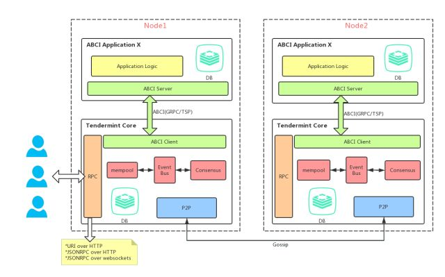
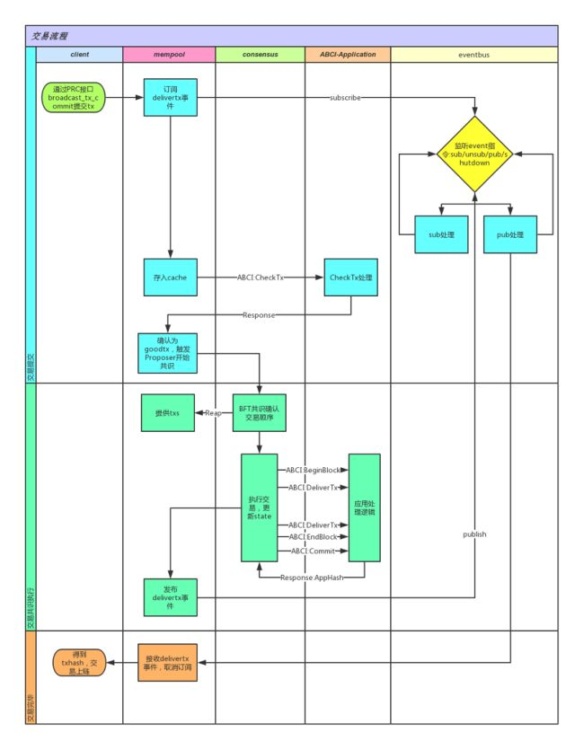

# Tendermint

### 架构流程

client通过RPC接口broadcast_tx_commit提交交易；

mempool调用ABCI接口CheckTx用于校验交易的有效性，比如交易序号、发送者余额等，同时订阅交易执行后的事件并等待监听。

共识从mempool中获取交易开始共识排序，

协议中有两个角色：

- 验证人：协议中的角色或者节点，不同的验证者在投票过程中具备不同的权力（vote power）。
- 提议人：由验证人轮流产生。

验证人轮流对交易的区块提议并对提议的区块投票。区块被提交到链上，且每个区块就是一个区块高度。但区块也有可能提交失败，这种情况下协议将选择下一个验证人在相同高度上提议一个新块，重新开始投票。

从图中可以看到，成功提交一个区块，必须经过两阶段的投票，称为pre-vote和pre-commit。当超过 2/3 的验证人在同一轮提议中对同一个块进行了pre-commit投票，那么这个区块才会被提交。

由于离线或者网络延迟等原因，可能造成提议人提议区块失败。这种情况在Tendermint中也是允许的，因为验证人会在进入下一轮提议之前等待一定时间，用于接收提议人提议的区块。

假设少于三分之一的验证人是拜占庭节点，Tendermint能够保证验证人永远不会在同一高度重复提交区块而造成冲突。为了做到这一点，Tendermint 引入了锁定机制，一旦验证人预投票了一个区块，那么该验证人就会被锁定在这个区块。然后：

1. 该验证人必须在预提交的区块进行预投票。

2. 当前一轮预提议和预投票没成功提交区块时，该验证人就会被解锁，然后进行对新块的下一轮预提交。

   

Commit 阶段先执行BeginBlock，DeliverTxAsync，EndBlock，然后再执行Commit

**PBFT相同点：**

1. 同属BFT体系。
2. 抗1/3拜占庭节点攻击。
3. 三阶段提交，第一阶段广播交易（区块），后两阶段广播签名（确认）。
4. 两者都需要达到法定人数才能提交块。

**与PBFT不同点：**

1. Tendermint与PBFT的区别主要是在超过1/3节点为拜占庭节点的情况下。当拜占庭节点数量在验证者数量的1/3和2/3之间时，PBFT算法无法提供保证，使得攻击者可以将任意结果返回给客户端。而Tendermint共识模型认为必须超过2/3数量的precommit确认才能提交块。举个例子，如果1/2的验证者是拜占庭节点，Tendermint中这些拜占庭节点能够阻止区块的提交，但他们自己也无法提交恶意块。而在PBFT中拜占庭节点却是可以提交块给客户端。

2. **另一个不同点在于拜占庭节点概念不同，PBFT指的是节点数，而Tendermint代表的是节点的权益数，也就是投票权力**。

3. 最后一点，PBFT需要预设一组固定的验证人，而Tendermint是通过要求超过2/3法定人数的验证人员批准会员变更，从而支持验证人的动态变化。

   

**关于P2P网络**

- P2P：采用gossip算法，默认端口是46656。

- RPC：区块链对外接口，默认端口是46657。支持三种访问方式：`URI over HTTP`、`JSONRPC over HTTP`、`JSONRPC over websockets`。

Tendermint的P2P网络协议借鉴了比特币的对等发现协议，更准确地说，Tendermint是采用了BTCD的P2P地址簿（Address Book）机制。当连接建立后，新节点将自身的Address信息（包含IP、Port、ID等）发送给相邻节点，相邻节点接收到信息后加入到自己的地址薄，再将此条Address信息，转播给它的相邻节点。

此外为了保证节点之间数据传输的安全性，Tendermint采用了基于Station-to-Station协议的认证加密方案，此协议是一种密钥协商方案，基于经典的DH算法，并提供相互密钥和实体认证。大致的流程如下：

1. 每一个节点都必须生成一对ED25519密钥对作为自己的ID。
2. 当两个节点建立起TCP连接时，两者都会生成一个临时的ED25519密钥对，并把临时公钥发给对方。
3. 两个节点分别将自己的私钥和对方的临时公钥相乘，得到共享密钥。这个共享密钥对称加密密钥。
4. 将两个临时公钥以一定规则进行排序，并将两个临时公钥拼接起来后使用Ripemd160进行哈希处理，后面填充4个0，这样可以得到一个24字节的随机数。
5. 得到的随机数作为加密种子，但为了保证相同的随机数不会被相同的私钥使用两次，我们将随机数最后一个bit置为1，这样就得到了两个随机数，同时约定排序更高的公钥使用反转过的随机数来加密自己的消息，而另外一个用于解密对方节点的消息。
6. 使用排序的临时公钥拼接起来，并进行SHA256哈希，得到一个挑战码。
7. 每个节点都使用自己的私钥对挑战码进行签名，并将自己的公钥和签名发给其它节点校验。
8. 校验通过之后，双方的认证就验证成功了。后续的通信就使用共享密钥和随机数进行加密，保护数据的安全。

#### **Tendermint工作流**

​     上图简单描述了Tenermint的工作流。大致为：

1. client通过RPC接口broadcast_tx_commit提交交易；
2. mempool调用ABCI接口CheckTx用于校验交易的有效性，比如交易序号、发送者余额等，同时订阅交易执行后的事件并等待监听。
3. 共识从mempool中获取交易开始共识排序，打包区块，确定之后依次调用ABCI相关接口更新当前的世界状态，并触发事件。
4. 最终将交易信息返回client。

### ABCI接口

ABCI接口可以分为三类：信息查询、交易校验以及共识相关处理。而Tendermint Core作为ABCI Client在启动时，会与ABCI Server建立三个连接，分别用于这三类接口消息的处理。

在Tendermint Core与Application交互的所有消息类型中，有3种主要的消息类型：

1. CheckTx消息用于验证交易。Tendermint Core中的mempool通过此消息校验交易的合法性，通过之后才会将交易广播给其它节点。
2. DeliverTx消息是应用的主要工作流程，通过此消息真正执行交易，包括验证交易、更新应用程序的状态。
3. Commit消息通知应用程序计算当前的世界状态，并存在下一区块头中。

## Reference

- [深度剖析区块链跨链技术Cosmos(上篇)](https://mp.weixin.qq.com/s?__biz=MzUyMjg0MzIxMA==&mid=2247483679&idx=1&sn=1fadfa95a266e199c3f2966c2decfbae&chksm=f9c4e43aceb36d2c19f07450f98a2938ef345aeb454f0f668057e66a89adb0dfda91910cccd9&scene=21#wechat_redirect)