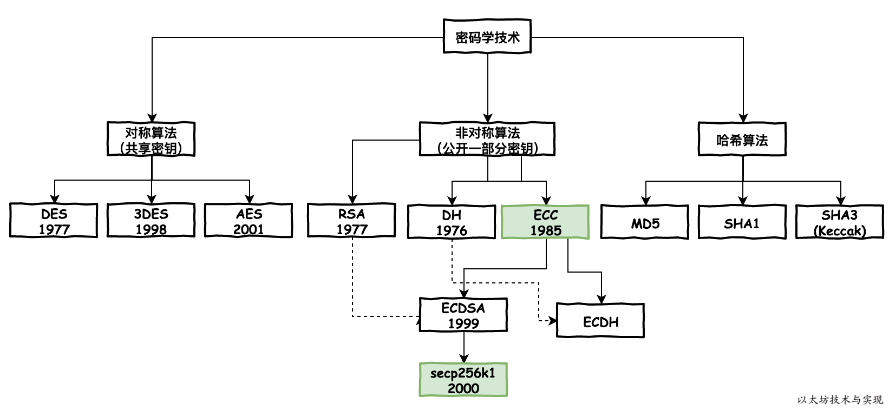

# 签名

## 签名算法类别



### 简单理解椭圆曲线

- 模乘运算：已知 2 个大质数（x，y），相乘算出结果比较容易，例如 2003*4003 =8018009，
- 模除运算：但已知相乘结果8018009，推算出 （x， y）成本是要高的。

在椭圆曲线运算中，质数的模乘运算较为简单，但模除运算（反向运算）几乎不可能。（离散对数难题，笔者望而却步）。


ETH 和 BTC 的签名算法：椭圆曲线算法 secp256k1。

签名中最重要的是 checksig， bitcoin单签执行一定包括 `signature  pubkey checksig`，即针对签名结果进行验签


## **椭圆曲线数字签名算法(ECDSA)**

主要信息

- 用户的密钥对:`（d, Q）`；(`d为私钥，Q为公钥`)

- 待签名的信息：`M`； 

- 签名：`Signature(M) = ( r, s)`


### 签名过程：

已知私钥 `d `,  和待签名的消息 `M`，计算其签名` (r, s)`

- 1、根据ECC算法随机生成一个临时密钥对`(k, R), R=(xR, yR)`。(曲线上`R点(x,y)`的大整数)
- 2、令 ` r = xR mod n`，如果r = 0，则返回步骤1. 此处可计算得到 r

- 3、计算 `H = Hash(M) `

- 4、按照数据类型转换规则，将H转化为一个big endian的整数e 

- 5、`s = k^-1 (e + rd) mod n`，若s = 0, 则返回步骤1 

- 6、输出的S =(r,s) 即为签名

  可参考代码 [threshold-signature-demo](https://github.com/gitzhou/threshold-signature-demo/blob/ee1e263efb65d12d6b693e26ddf55a594a1d6105/sign.py#L13)

  ```python
  def sign(private_key: int, message: bytes) -> tuple:
      """Create ECDSA signature (r, s)"""
      e = hash_to_int(message)
      r, s = 0, 0
      while not r or not s:
          k = random.randrange(1, curve.n)
          k_x, _ = scalar_multiply(k, curve.g)
          r = k_x % curve.n
          s = ((e + r * private_key) * modular_multiplicative_inverse(k, curve.n)) % curve.n
      return r, s
  ```

  


### 验证过程：

已知公钥 `Q`,  和待签名的消息 `M`，签名` (r, s)`， 验证签名是否有效

- 1、 计算 `H = Hash(M) `

- 2、按照数据类型转换规则，将H转化为一个big endian的整数e 

- 3、计算 `u1 = es^-1 mod n`, `u2 = rs^-1 mod n `

- 4、计算 `R = (xR, yR) = u1G + u2Q`, 如果R = 零点，则验证该签名无效 

- 5、令 `v = xR mod n `    

- 6、 若 `v == r`，则签名有效，若 `v ≠ r`, 则签名无效

  可参考代码. [threshold-signature-demo](https://github.com/gitzhou/threshold-signature-demo/blob/ee1e263efb65d12d6b693e26ddf55a594a1d6105/sign.py#L40)

  ```python
  def verify_signature(public_key: tuple, message: bytes, signature: tuple) -> bool:
      """Verify signature with public key and message"""
      e = hash_to_int(message) # 计算 message 的hash, 并且转换为BigInteger  e
      r, s = signature         # 签名其实就是 r,s 值
      w = modular_multiplicative_inverse(s, curve.n) #计算 s^-1
      u1 = (w * e) % curve.n #  u1 = e * s^−1 mod n
      u2 = (w * r) % curve.n #  u2 = r * s^−1 mod n
      x, _ = add(scalar_multiply(u1, curve.g), scalar_multiply(u2, public_key))
      return r == (x % curve.n)
  ```


### 恢复过程Recover 

已知消息 `M` 和签名`(r,s)`，恢复计算出公钥Q。

- 1、 计算 `H = Hash(M) `
- 2、按照数据类型转换规则，将H转化为一个big endian的整数e 
- 3、计算`R=(x, y)，其中x=r,r+n,r+2n…`，代入椭圆曲线方程计算获得R
- 4、计算`u1 = −er^−1 mod n` , `u2 = sr^−1 mod n`
- 5、计算公钥`Q= (x’, y’)=u1⋅G+u2⋅R`


## ETH 黄皮书

```
ECDSAPUBKEY(pr ∈ B32)  ≡ pu ∈ B64

ECDSASIGN(e ∈ B32,pr ∈ B32) ≡ (v ∈ B1,r ∈ B32,s ∈ B32)

ECDSARECOVER(e ∈ B32,v ∈ B1,r ∈ B32,s ∈ B32) ≡ pu ∈ B64
```


## Reference

- [threshold-signature-demo](https://github.com/gitzhou/threshold-signature-demo)

- [椭圆曲线数字签名算法](https://aaron67.cc/2020/09/30/ecdsa/)

- [比特币系统采用的公钥密码学方案和ECDSA签名算法介绍——第一部分：原理](https://www.8btc.com/article/16481)

- [一个数字引发的探索——ECDSA解析](https://fisco-bcos-documentation.readthedocs.io/zh_CN/latest/docs/articles/3_features/36_cryptographic/ecdsa_analysis.html)

- [以太坊技术与实现](https://learnblockchain.cn/books/geth/part3/sign-and-valid.html)