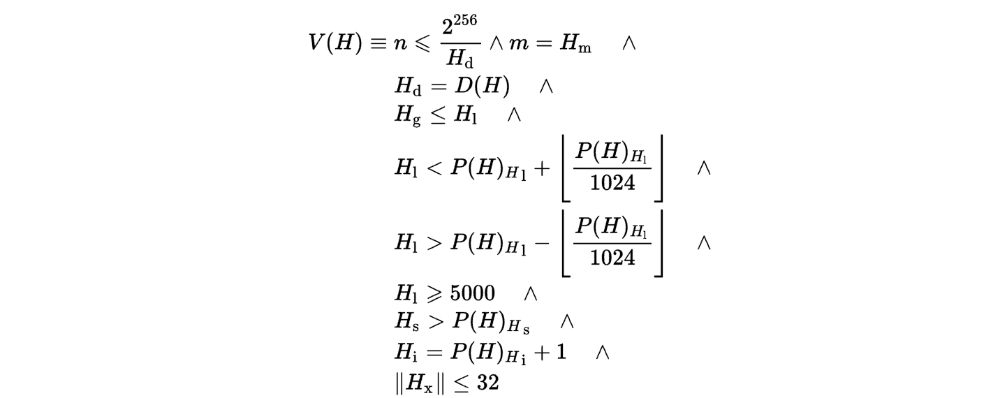

# ETH SPV

## 什么是SPV

**轻钱包(SPV)**是“Simplified Payment Verification”（简单支付验证）的缩写。中本聪论文简要地提及了这一概念，指出：不运行完全节点也可验证支付，用户只需要**保存所有的block header**就可以了。用户虽然不能自己验证交易，但如果能够从区块链的某处找到相符的交易，他就可以知道网络已经认可了这笔交易，而且得到了网络的多少个确认。


## ETH 数据结构

###  Block

以太坊中的一个区块由区块头Header，以及交易列表 ,以及叔块的  `header ` 集合三部分组成。


具体结构如下图


### Block Header

```go
// Header represents a block header in the Ethereum blockchain.
type Header struct {
	ParentHash  common.Hash    `json:"parentHash"       gencodec:"required"`
	UncleHash   common.Hash    `json:"sha3Uncles"       gencodec:"required"`
	Coinbase    common.Address `json:"miner"            gencodec:"required"`
	Root        common.Hash    `json:"stateRoot"        gencodec:"required"`
	TxHash      common.Hash    `json:"transactionsRoot" gencodec:"required"`
	ReceiptHash common.Hash    `json:"receiptsRoot"     gencodec:"required"`
	Bloom       Bloom          `json:"logsBloom"        gencodec:"required"`
	Difficulty  *big.Int       `json:"difficulty"       gencodec:"required"`
	Number      *big.Int       `json:"number"           gencodec:"required"`
	GasLimit    uint64         `json:"gasLimit"         gencodec:"required"`
	GasUsed     uint64         `json:"gasUsed"          gencodec:"required"`
	Time        uint64         `json:"timestamp"        gencodec:"required"`
	Extra       []byte         `json:"extraData"        gencodec:"required"`
	MixDigest   common.Hash    `json:"mixHash"`
	Nonce       BlockNonce     `json:"nonce"`
}
```

`Header`包括以下字段。

- `ParentHash`    用  `Hp` 表示。

  - 父节点的`hash`值, 每个区块有且只有一个父区块, 但允许某个时候存在多个子块（分叉）。

- `UncleHash`     用  `Ho`  表示。

  - `Block`结构体的成员 `uncles` 进行 RLP 编码后的 Hash 值，这块是跟`GHOST`相关的，

- `Coinbase`       用 `Hc` 表示。  矿工address 

- `stateRoot`     用 `Hr` 表示。

  - `StateDB`中的 `state Trie` 的根节点的RLP哈希值。Block中，每个账户以`stateObject`对象表示，账户以`Address`为唯一标示，其信息在相关交易`Transaction`的执行中被修改。所有账户对象可以逐个插入一个`Merkle-PatricaTrie(MPT)`结构里，形成 `state Trie`。  

- `transactionsRoot`    用  `Ht` 表示。  

  -  `Block`中 `tx Trie` 的根节点的RLP哈希值。`Block`的成员变量`transactions`中所有的tx对象，被逐个插入一个`MPT`结构，形成 `tx Trie`。

- `receiptsRoot`   用`He`表示。
- `Block`中的 `Receipt Trie` 的根节点的RLP哈希值。`Block`的所有`Transaction`执行完后会生成一个`Receipt`数组，这个数组中的所有`Receipt`被逐个插入一个MPT结构中，形成 `Receipt Trie`。

- `logsBloom`      用 `Hb` 表示。  

  - `Bloom`过滤器(`Filter`)，用来快速判断一个参数`Log`对象是否存在于一组已知的`Log`集合中

- `difficulty`    用 `Hd`表示。

  - 区块的难度。`Block`的`Difficulty`由共识算法基于`parentBlock`的`Time`和`Difficulty`计算得出

- `number`         用 ` Hi` 表示。 区块号

- `gasLimit`     用 `Hl` 表示。区块的`gas`数量限制，即区块中交易使用掉的`gas`值不应该超过该值。

- `gasUsed`       用 `Hg` 表示。区块使用掉的gas数量，

- `timestamp`   用 `Hs` 表示。时间戳，

- `extraData`   用 `Hx` 表示。额外的数据，合法的交易对长度有限制，

- `mixHash`       用 `Hm` 表示。与`nonce`一起用作工作量证明，

- `nonce`           用 `Hn` 表示。`PoW` 中使用的随机数 与`mixHash`一起用作工作量证明，


### 区块头校验 

- **校验区块号和区块hash的符号化表示** 

  

  


- **难度计算的符号化表示** 

  


- 当区块编号为0的时候其难度值是固定好的，在这里用*D*0表示，其值为`131072`.
  
  - 对于其他区块，其难度值需要根据其父区块难度值以及一些其他因素，出块的间隔时间，区块编号等有关进行调节的，若小于*D*0，则难度值调整为*D*0。
  
    


- 调节系数   `the adjustment factor`   *x* 的定义。

  

  


  - 难度系数（`diculty parameter`）*ς*2的定义。该系数主要与出块间隔时间有关，当间隔大的时候，系数变大，难度也会相应变大，当间隔小的时候，系数变小，难度也会变小。使得区块链在整体上出块时间是趋于稳定的。其中*y*值根据父节点的uncle节点是否为空而有所区别，可以看出当父节点的uncle不为空的时候，*y*值为2，说明当前的分叉程度较大，适当调大难度，一定程度上会减少分叉。

    


- **gasLimit限制的符号化表示**
  
  


  - 区块`gasLimit`必须大于等于5000，和上个区块的`gasLimit`差值不超过 `上个块 gasLimit 除以 1024` 

  

- **时间戳的符号化表示**
  
   {P(H)_{H}}_{\mathrm{s}}" />
  
  - 当前区块的时间戳必须大于父区块的时间戳

- **mixHash和nonce相关符号化表示**

  


- **总体而言：区块头验证的符号化表示 如下**

  


## 为什么用SPV


以太坊区块的存储的信息主要包含两部分内容：Header和Body.
Body主要由交易列表和Uncle Block构成；Header的内容更为丰富，主要有父区块的hash，时间戳，挖矿的难度等．
而Header中最重要的是以太坊的是＂三棵树＂，对应于区块头中的StateRoot，TransactionRoot和ReceiptRoot三个哈希值


light client 只会同步 ETH 的 Block header data 。 由于没有具体的交易信息，只有 Block header data 无法验证某一个交易是否被确认，所以只能通过 Merkle 证明来判断一笔交易是否在现在的区块链交易列表中。

用户在验证一笔交易的时候就不需要知道其他交易的数据，只需要其他交易的交易哈希(Txhash)，然后计算这笔交易的hash值，再逐步计算出Merkle Root并与接收到的Block Header的Merkel Root对比就可以验证交易是否存在了（需要用户提供交易的信息： 区块块高，交易的index）


lght client  无法识别最长链（规范链）


## 如何维护一个 light client

- 计算 receiptsRoot 提供 tx 的校验
- 计算 header data 的校验


## Reference

[轻节点SPV](https://zhuanlan.zhihu.com/p/72012947)

[go-ethereum 源码分析 - 区块结构(1)](https://stevenocean.github.io/2018/03/17/go-ethereum-source-analysize-1.html)

[以太坊黄皮书详解（一）](https://yuan1028.github.io/ethereum-yellow-paper/)


