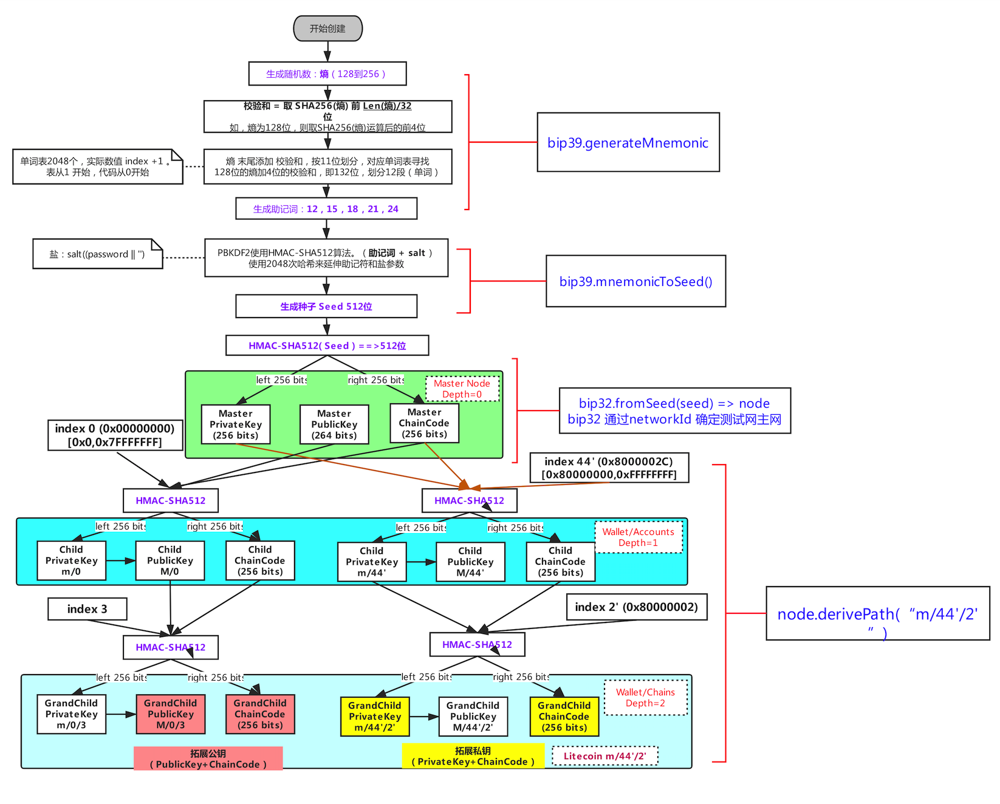

# BIP39、BIP44、BIP32 协议


## HD 钱包导入流程

<!-- <html>

</html> -->


## BIP39
熵每次都可以得到不同的助记词  

```math

CS = ENT /32 

checksum = SHA256(entropy)

MS = (ENT + CS) / 11 
```

ENT：熵长度。CS：校验长度。MS：助记词长度。checksum：校验和  
校验和： 对熵取SHA256哈希结果前CS位

|  ENT  | CS | ENT+CS |  MS  |
--------|----|--------|------|
|  128  |  4 |   132  |  12  |
|  160  |  5 |   165  |  15  |
|  192  |  6 |   198  |  18  |
|  224  |  7 |   231  |  21  |
|  256  |  8 |   264  |  24  |

### 创建助记词
1. 创建一个128到256位的随机序列（熵）。
2. 提出SHA256哈希前几位（熵长/ 32），就可以创造一个随机序列的校验和。
3. 将校验和添加到随机序列的末尾。
4. 将序列划分为包含11位的不同部分。
5. 将每个包含11位部分的值与一个已经预先定义2048个单词的字典做对应。
6. 生成的有顺序的单词组就是助记码。

<html>

</html>

### 助记词生成种子（seed）
创建助记词之后的7-9步是：

7. PBKDF2密钥延伸函数的第一个参数是从步骤6生成的助记符。
8. PBKDF2密钥延伸函数的第二个参数是盐。 由字符串常数“助记词”与可选的用户提供的密码字符串连接组成。
9. PBKDF2使用HMAC-SHA512算法，使用2048次哈希来延伸助记符和盐参数，产生一个512位的值作为其最终输出。 这个512位的值就是种子。

图5-7显示了从助记词如何生成种子 
<html>

</html>


## BIP32
### 分层路径
<html>

</html>

### 从 Seed 创建 HDWallet

HD钱包从单个根种子（root seed）中创建，为128到256位的随机数。常见的通过助记词可以确定种子Root Seed。

HD钱包的所有的确定性都衍生自这个根种子。任何兼容HD 钱包的根种子也可重新创造整个HD钱包。
<html>

</html>
子私钥推导
HD 钱包使用 CKD(child key derivation) 函数从父密钥(parent keys)推导子密钥(child keys)，CKD 由下列三个要素做单向散列哈希(one way hash function) 。  

- 父密钥 (没有压缩过的椭圆曲线推导的私钥或公钥 ECDSA uncompressed key)
- 链码作为熵 (chain code 256 bits)
- 子代索引序号 (index 32 bits)  

钱包安全的核心在私钥，而公钥则比较容易被找到，如果子节点生成过程只依赖父节点公钥和子节点序号，那么黑客拿到父节点公钥之后就能复原出所有子节点、孙节点的公钥，这样就会破坏隐私性，CKD 里面引入的 Chain Code 则是在整个子节点派生过程中引入确定的随机数，为 HD 钱包的隐私性增加了一重保障。

#### 正常衍生子密钥
<html>

</html>

#### 强化衍生子密钥
<html>

</html>

-  图上标识了 索引号码 根据 正常衍生 和 硬化衍生不同，索引的范围不同，对于正常衍生的索引号范围为 [0x0, 0x7FFFFFFF]，而硬化衍生的索引号范围为 [0x80000000, 0xFFFFFFFF]  

- 硬化衍生的索引号太长，一般为了便于阅读，都是会将索引号右上角加上撇号，譬如：0x80000000 记为 0’，0x80000001 记为 1’，以此类推.   


针对 扩展密钥 的学习，可以看到有三种生成规则，分别如下：


- Private parent key -> private child key  
  即，从 父私钥 和 父链码 计算生成 子私钥 和 子链码。用公式表示就是：
```
CKDpriv((kpar, cpar), i) → (ki, ci)
```
>- 检查 是否 i ≥ 2^31(子私钥)。   
如果是（硬化的子密钥）：让I= HMAC-SHA512（Key = cpar，Data = 0x00 || ser256（kpar）|| ser32（i））（注意：0x00将私钥补齐到33字节长。）  
如果不是（普通的普通子密钥）：让I= HMAC-SHA512（Key = cpar，Data = serP（point（kpar））|| ser32（i））。
>- 将I分为两个32字节序列，IL和IR。
>- 返回的子密钥ki是parse256（IL）+ kpar（mod n）。
>- 返回的链码ci是IR。
>- 如果parse256（IL）≥n或ki = 0，则生成的密钥无效，并且应继续下一个i值。 （注：概率低于1/2127）


- Public parent key -> public child key  
  即，从 父公钥 和 父链码 计算生成 子公钥 和 子链码。公式表示如下：

```
CKDpub((Kpar, cpar), i) → (Ki, ci)
```

>- 检查是否 i ≥ 2^31 (子密钥是否是硬化密钥)  
如果是(硬化子密钥)：返回失败  
如果不是(普通子密钥):让I= HMAC-SHA512(Key = cpar, Data = serP(Kpar) || ser32(i)).
>- 将I分为两个32字节序列，IL和IR。
>- 返回的子密钥Ki是point（parse256（IL））+ Kpar。
>- 返回的链码ci是IR。
>- 如果parse256（IL）≥n或Ki是无限远的点，则生成的密钥无效，并且应继续下一个i值。
- Private parent key -> public child key  

  即，从 父私钥 和 父链码 计算生成 子公钥 和 子链码。公式表示如下：

```
N((k, c)) → (K, c)
```
>- 返回的密钥K是point（k）。
>- 返回的链码c只是传递的链码。

要计算父私钥的公用子密钥：

>- N（CKDpriv（（kpar，cpar），i））（总是工作）。
>- CKDpub（N（kpar，cpar），i）（仅适用于非硬化子密钥）。

它们等价的事实是使非硬化密钥有用（可以在不知道任何私钥的情况下导出给定父密钥的子公钥），以及它们与硬密钥的区别。 不总是使用非硬化键（更有用）的原因是安全性; 后面可以了解更详细的信息。  


<html>

</html>

## BIP44
BIP32路径中的5个层次定义：
```
m / purpose' / coin_type' / account' / change / address_index
```
路径中的撇号表示使用了经过硬化（hardern）处理的BIP32派生。

1. purporse': 固定值44'(或0x8000002C), 代表是BIP44  
2. coin_type': 这个代表的是币种, 可以兼容很多种币, 比如BTC是0', ETH是60'  
硬化的派生在这个级别上使用。（所以右上角有 ' 标记）币种，代表一个主节点（种子）可用于无限数量的独立加密币，如比特币等。此级别为每个加密币创建一个单独的子树，避免重用已经在其它链上存在的地址。开发人员可以为他们的项目注册未使用的号码
3. Account:   一类coin下能够有多个账户，就相当于你的人民币会存在多张银行卡    以顺序递增的方式从索引0开始编号。这个数字在BIP32派生中用作子索引。
4. Change: 表明为外部链0或内部链1：常量0用于外部链，常量1用于内部链(也称为更改地址)。外部链用于在钱包外部可见的地址(例如用于接收付款)。内部链用于不在钱包外部可见的地址，用于返回交易更改.**一个是用来接收地址一个是用来创造找零地址**
5. Index:  被HD钱包衍生的真正可用的地址是第四层级的子级，就是第五层级的树的“address_index”。比如，第三个层级的主账户如M/44'/0'/1'收到比特币真正支付的地址是 M/44'/0'/0'/0/2 

最后我们简要介绍一下 BIP44 中的账户发现算法：

1. 推导出第一个账户节点（生成编号初始值设为 0）
2. 推导出这个账户的外部链
3. 依次扫描外部链上的地址，如果连续二十个地址都没有交易记录，停止扫描
4. 如果外部链上没有发现交易，退出
5. 如果存在交易，将生成编号的值增加 1，跳转到第一步

一句话概括下BIP44就是：给BIP32的分层路径定义规范  


## reference  
[Ethereum HD Ｗallet（虚拟货币钱包）-BIP32、BIP39、BIP44](https://www.cnblogs.com/wanghui-garcia/p/9970735.html)  
[理解开发HD 钱包涉及的BIP32、BIP44、BIP39](https://learnblockchain.cn/2018/09/28/hdwallet/)

[基于 BIP-32 和 BIP-39 规范生成 HD 钱包（分层确定性钱包）](https://stevenocean.github.io/2018/09/23/generate-hd-wallet-by-bip39.html)  
[分层确定性钱包 HD Wallet 剖析：设计和实现](https://www.arcblock.io/zh/post/2018/12/01/hd-wallets-design-and-implementation)

