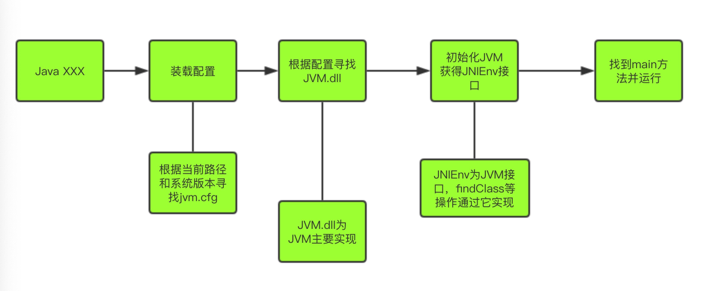
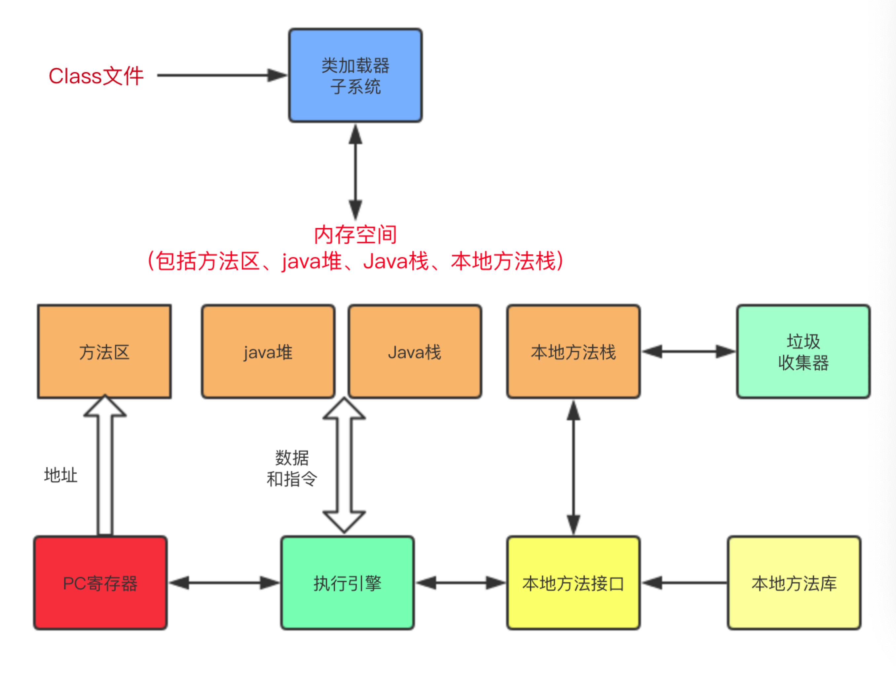
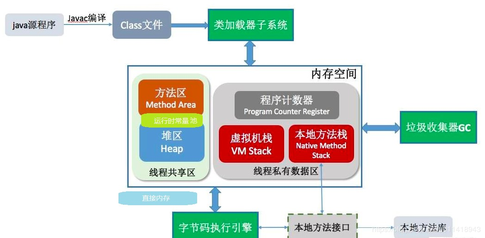
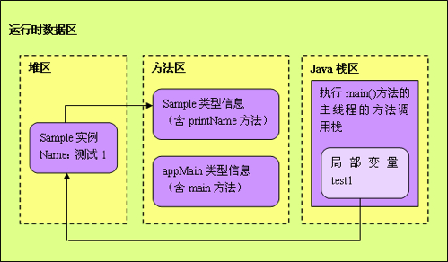

# JVM 运行机制

### 1、启动流程




###  2、JVM基本结构





####  2 .1、PC寄存器

- 每个线程拥有一个PC寄存器
- 在线程创建时创建
- 指向下一条指令的地址
- 执行本地方法时，PC的值为undefine

#### 2 .2、 方法区

- 保存装载的类信息:
  - 类型的常量池
  - 字段、方法信息
  - 方法字节码 
- 通常和永久区(Perm)关联在一起

#### 2.3、Java堆

- 和程序开发密切相关
- 应用系统对象都保存在Java堆中
- 所有线程共享Java堆
- 对分代GC来说，堆也是分代的
- GC的主要工作区间

#### 2.4 、Java栈

- 线程私有
- 栈由一系列帧组成(因此Java栈也叫Java帧栈)
- 帧保存一个方法的局部变量、操作数帧、常量池指针
- 每一次方法调用创建一个帧，并压栈

#### 2.4 、栈、堆、方法区交互

```java
public class AppMain {
    //运行时, jvm 把appmain的信息都放入方法区 

    //main 方法本身放入方法区。
    public static void main(String[] args) {
        //test1是引用，所以放到栈区里， Sample是自定义对象应该放到堆里面 

        Sample test1 = new Sample(" 测试1 ");
        Sample test2 = new Sample(" 测试2 ");
        test1.printName();
        test2.printName();
    }
}
//运行时, jvm 把appmain的信息都放入方法区 
class Sample{
    private String name;

    //new Sample实例后， name 引用放入栈区里，  name 对象放入堆里 
    public Sample(String name) {
        this.name = name;
    }
    //print方法本身放入方法区里。
    public void printName() { System.out.println(name);
    }
}
```

