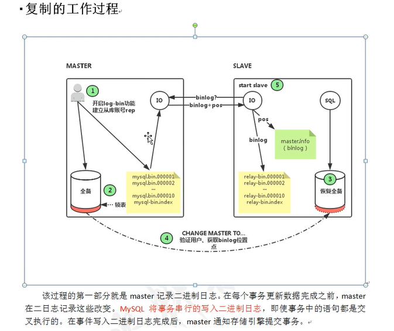

# 使用 Docker 搭建 MySQL 主从复制

## 主从复制原理





复制原理
mysql的复制原理大致如下。

- 主库开启bin-log二进制日志功能，并建立slave账号，并授权从库连接主库，从库通过change master得到主库的相关同步信息。mysql主库在事务提交时会把数据库变更作为事件Events记录在二进制文件binlog中；mysql主库上的sys_binlog控制binlog日志刷新到磁盘。
- 从库然后连接主库进行验证，主库产生的新数据会导入到bin-log二进制文件中，同时主库会开启IO线程，从库也会开启IO线程以及SQL线程，从库中的IO线程与主库的IO线程连接一旦主库库数据有所变更则从库将变更的数据复制到relary-bin（中继日志）中。SQL线程会读取relay log（中继日志）文件中的日志，并解析成具体操作，至此整个同步过程完成。


## 主从复制操作

### 流程命令集

```shell
# 1、搭建部署 mysql
docker run --name mysql1 -p 33061:3306 -e MYSQL_ROOT_PASSWORD=123 -d mysql:5.7 --character-set-server=utf8mb4 --collation-server=utf8mb4_unicode_ci
docker run --name mysql2 -p 33062:3306 -e MYSQL_ROOT_PASSWORD=123 -d mysql:5.7 --character-set-server=utf8mb4 --collation-server=utf8mb4_unicode_ci

# 2、主机配置
## 2.1、进入mysql
mysql -u root -h 127.0.0.1 -P 33061 -p

## 2.2、 主机配置 配置一个从机登录用户
GRANT REPLICATION SLAVE ON *.* TO 'user'@'%' IDENTIFIED BY '123';  

## 2.3、进入docker容器
docker exec -it mysql1 bash

## 2.4、需要修改 MySQL 的配置，开启 binlog
vi /etc/mysql/mysql.conf.d/mysqld.cnf


# 3、从机配置
## 3.1、进入mysql
mysql -u root -h 127.0.0.1 -P 33061 -p


## 3.2、从配置 配置一个从机登录用户
change master to master_host='192.168.66.114',master_port=33061,master_user='user',master_password='123',master_log_file='binlog.000001',master_log_pos=154;

## 3.3、 slave 启动或停止
start slave;
stop slave;

## 3.4、 查看slave配置正确与否
show slave status\G;

####Slave_IO_Running 和 Slave_SQL_Running ，这两个的值必须为 Yes。
```


### 配置相关文件

####  主机MySQL 配置文件 mysqld.cnf

- binlog 的开启，需要修改 MySQL 的配置，因此，我们需要进入到容器内部去执行。

  `docker exec -it mysql1 /bin/bash`

-  MySQL 配置文件`/etc/mysql/mysql.conf.d/mysqld.cnf` 追加以下内容

  ```yaml
  # 第一行表示配置 binlog 的位置，理论上 binlog 可以放在任意位置，但是该位置，MySQL 一定要有操作权限。
  log-bin=/var/lib/mysql/binlog
  
  #server-id 表示集群中，每个实例的一标识符
  server-id=1
  
  # 不同步哪些数据库  
  binlog-ignore-db = mysql  
  binlog-ignore-db = test  
  binlog-ignore-db = information_schema  
    
  # 只同步哪些数据库，除此之外，其他不同步  
  binlog-do-db = game  
  ```


​         File 和 Position 需要记着，这两个标记了二进制日志的起点位置，在从机的配置中将使用到这两个参数。

#### 从机配置

- `show slave status;`
  - `Slave_IO_State`: 当前`I/O`线程的状态
  - `Master_Log_File`: 当前同步的主服务器的二进制文件
  - `Read_Master_Log_Pos`: 当前同步的主服务器的二进制文件的偏移量，单位为字节，如图中为已经同步了`12.9M(13630580/1024/1024)`的内容
  - `Relay_Master_Log_File`: 当前中继日志同步的二进制文件
  - `Slave_IO_Running`: 从服务器中`I/O`线程的运行状态，`YES`为运行正常
  - `Slave_SQL_Running`: 从服务器中`SQL`线程的运行状态，`YES`为运行正常
  - `Exec_Master_Log_Pos`: 表示同步完成的主服务器的二进制日志偏移量
  - `Seconds_Behind_Master`: 表示从服务器数据比主服务器落后的持续时长


## 参考链接

[使用 Docker 搭建 MySQL 主从复制](http://www.javaboy.org/2019/1101/docker-mysql.html)