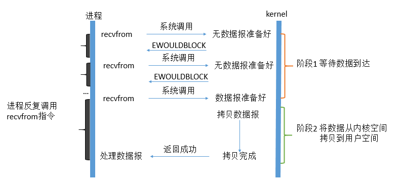

# 网络I/O模型

###  数据操作

对于一个network IO (以read举例)，它会涉及到两个系统对象：一个是调用这个IO的进程，另一个就是系统内核(kernel)。当一个read操作发生时，它会经历两个阶段：

**阶段1**: 等待数据准备 (Waiting for the data to be ready)

**阶段2**: 将数据从内核拷贝到进程中 (Copying the data from the kernel to the process)

**用户空间**  是常规进程所在区域。 JVM 就是常规进程，驻守于用户空间。用户空间是非特权区域：比如，在该区域执行的代码就不能直接访问硬件设备。

**内核空间**  是操作系统所在区域。内核代码有特别的权力：它能与设备控制器通讯，控制着用户区域进程的运行状态，等等。最重要的是，所有 I/O 都直接（如这里所述）或间接通过内核空间。

当进程请求 I/O 操作的时候，它执行一个系统调用将控制权移交给内核。C/C++程序员所熟知的底层函数 open( )、 read( )、 write( )和 close( )要做的无非就是建立和执行适当的系统调用。当内核以这种方式被调用，它随即采取任何必要步骤，找到进程所需数据，并把数据传送到用户空间内的指定缓冲区。内核试图对数据进行高速缓存或预读取，因此进程所需数据可能已经在内核空间里了。如果是这样，该数据只需简单地拷贝出来即可。如果数据不在内核空间，则进程被挂起，内核着手把数据读进内存。

### 1、阻塞式I/O：blocking IO

在linux中，默认情况下所有的socket都是blocking，一个典型的读操作流程大概是这样：

- 第一步通常涉及等待数据从网络中到达。当所有等待数据到达时，它被复制到内核中的某个缓冲区。

- 第二步就是把数据从内核缓冲区复制到应用程序缓冲区。

当用户进程调用了recvfrom这个系统调用，kernel就开始了IO的第一个阶段：准备数据。对于network io来说，很多时候数据在一开始还没有到达（比如，还没有收到一个完整的UDP包），这个时候kernel就要等待足够的数据到来。而在用户进程这边，整 个进程会被阻塞。当kernel一直等到数据准备好了，它就会将数据从kernel中拷贝到用户内存，然后kernel返回结果，用户进程才解除 block的状态，重新运行起来。

**所以，blocking IO的特点就是在IO执行的两个阶段都被block了。**

### 2、非阻塞式I/O： nonblocking IO

linux下，可以通过设置socket使其变为non-blocking。当对一个non-blocking socket执行读操作时，流程是这个样子：

从图中可以看出，当用户进程发出read操作时，如果kernel中的数据还没有准备好，那么它并不会block用户进程，而是立刻返回一个error。 从用户进程角度讲 ，它发起一个read操作后，并不需要等待，而是马上就得到了一个结果。用户进程判断结果是一个error时，它就知道数据还没有准备好，于是它可以再次 发送read操作。一旦kernel中的数据准备好了，并且又再次收到了用户进程的system call，那么它马上就将数据拷贝到了用户内存，然后返回。

**所以，用户进程第一个阶段不是阻塞的,需要不断的主动询问kernel数据好了没有；第二个阶段依然总是阻塞的。**

### 3、I/O复用（select，poll，epoll...）：IO multiplexing

IO复用同非阻塞IO本质一样，不过利用了新的select系统调用，由内核来负责本来是请求进程该做的轮询操作。看似比非阻塞IO还多了一个系统调用开销，不过因为可以支持多路IO，才算提高了效率。

基于内核，建立在epoll或者kqueue上实现，I/O多路复用最大的优势是用户可以在一个线程内同时处理多个Socket的I/O请求。通过一个线程监听全部的TCP连接，有任何事件发生就通知用户态处理即可。

它的基本原理就是select /epoll这个function会不断的轮询所负责的所有socket，当某个socket有数据到达了，就通知用户进程。它的流程如图：

当用户进程调用了`select`，那么整个进程会被block，而同时，kernel会“监视”所有select负责的socket，当任何一个 socket中的数据准备好了，select就会返回。这个时候用户进程再调用read操作，将数据从kernel拷贝到用户进程

这里需要使用两个system call (select 和 recvfrom)，而blocking IO只调用了一个system call (recvfrom)。但是，用select的优势在于它可以同时处理多个connection。（多说一句。所以，如果处理的连接数不是很高的话，使用 select/epoll的web server不一定比使用multi-threading + blocking IO的web server性能更好，可能延迟还更大。

**select/epoll的优势并不是对于单个连接能处理得更快，而是在于能处理更多的连接。**

实际中，对于每一个socket，一般都设置成为non-blocking，但是，如上图所示，整个用户的process其实是一直被 block的。只不过process是被select这个函数block，而不是被socket IO给block。

### 4、信号驱动式I/O（SIGIO）：signal driven IO

用的很少

### 5、异步I/O（POSIX的aio_系列函数）：asynchronous IO

这类函数的工作机制是告知内核启动某个操作，并让内核在整个操作（包括将数据从内核拷贝到用户空间）完成后通知我们。如图：

用户进程发起read操作之后，立刻就可以开始去做其它的事。而另一方面，从kernel的角度，当它受到一个asynchronous read之后，首先它会立刻返回，所以不会对用户进程产生任何block。然后，kernel会等待数据准备完成，然后将数据拷贝到用户内存，当这一切都 完成之后，kernel会给用户进程发送一个signal，告诉它read操作完成了。 在这整个过程中，进程完全没有被block。

**I/O 多路复用往往对应 Reactor 模式，异步 I/O 往往对应 Proactor。**

###  总结

前四种I/O模型都是同步I/O操作，他们的区别在于第一阶段，而他们的第二阶段是一样的：在数据从内核复制到应用缓冲区期间（用户空间），进程阻塞于recvfrom调用。 

### 参考

[Unix五种IO模型](http://www.tianshouzhi.com/api/tutorials/netty/221)