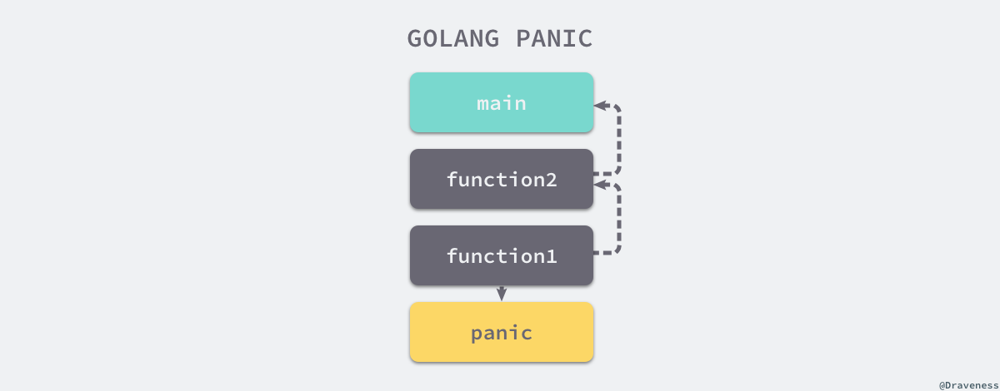

# 基础知识

### 数组

Go语言中数组是值语义。一个数组变量即表示整个数组，它并不是隐式的指向第一个元素的指针（比如C语言的数组），而是一个完整的值。当一个数组变量被赋值或者被传递的时候，实际上会复制整个数组。如果数组较大的话，数组的赋值也会有较大的开销。为了避免复制数组带来的开销，可以传递一个指向数组的指针，但是数组指针并不是数组。
```go
var a = [...]int{1, 2, 3} // a 是一个数组
var b = &a                // b 是指向数组的指针

fmt.Println(a[0], a[1])   // 打印数组的前2个元素
fmt.Println(b[0], b[1])   // 通过数组指针访问数组元素的方式和数组类似

for i, v := range b {     // 通过数组指针迭代数组的元素
    fmt.Println(i, v)
}
```
其实数组指针类型除了类型和数组不同之外，通过数组指针操作数组的方式和通过数组本身的操作类似，而且数组指针赋值时只会拷贝一个指针。

### 字符串

Go语言字符串的底层结构在reflect.StringHeader中定义：
```
type StringHeader struct {
    Data uintptr
    Len  int
}

uintptr是golang的内置类型，是能存储指针的整型
```
字符串结构由两个信息组成：第一个是字符串指向的底层字节数组，第二个是字符串的字节的长度。字符串其实是一个结构体，因此字符串的赋值操作也就是 `reflect.StringHeader`结构体的复制过程.

字符串虽然不是切片，但是支持切片操作，不同位置的切片底层也访问的同一块内存数据（因为字符串是只读的，相同的字符串面值常量通常是对应同一个字符串常量）：

### 切片
reflect.SliceHeader：
```
type SliceHeader struct {
    Data uintptr
    Len  int
    Cap  int
}

uintptr是golang的内置类型，是能存储指针的整型
```
只要是切片的底层数据指针、长度和容量没有发生变化的话，对切片的遍历、元素的读取和修改都和数组是一样的。在对切片本身赋值或参数传递时，和数组指针的操作方式类似，只是复制切片头信息（`reflect.SliceHeader`），并不会复制底层的数据。对于类型，和数组的最大不同是，切片的类型和长度信息无关，只要是相同类型元素构成的切片均对应相同的切片类型。

切片操作并不会复制底层的数据。底层的数组会被保存在内存中，直到它不再被引用。但是有时候可能会因为一个小的内存引用而导致底层整个数组处于被使用的状态，这会延迟自动内存回收器对底层数组的回收。

**切片中的底层数组部分是通过隐式指针传递(指针本身依然是传值的，但是指针指向的却是同一份的数据)**  
所以被调用函数是可以通过指针修改掉调用参数切片中的数据。

除了数据之外，切片结构还包含了切片长度和切片容量信息，这2个信息也是传值的。

如果被调用函数中修改了Len或Cap信息的话，就无法反映到调用参数的切片中，这时候我们一般会通过返回修改后的切片来更新之前的切片。这也是为何内置的append必须要返回一个切片的原因。

### Make 和 New

虽然 `make` 和 `new` 都是能够用于初始化数据结构，但是它们两者能够初始化的结构类型却有着较大的不同；`make` 在 Go 语言中只能用于初始化语言中的基本类型：

```go
slice := make([]int, 0, 100)
hash := make(map[int]bool, 10)
ch := make(chan int, 5)
```

- `slice` 是一个包含 `data`、`cap` 和 `len` 的**结构体**；

- `hash` 是一个指向 `hmap` 结构体的**指针**；

- `ch` 是一个指向 `hchan` 结构体的**指针**；

而另一个用于初始化数据结构的关键字 `new` 的作用其实就非常简单了，它只是接收一个类型作为参数然后返回一个指向这个类型的指针：

```go
i := new(int)
var v int
i := &v
```

上述代码片段中的两种不同初始化方法其实是等价的，它们都会创建一个指向 `int` 零值的指针。


到了这里我们对 Go 语言中这两种不同关键字的使用也有了一定的了解：`make` 用于创建切片、哈希表和管道等内置数据结构，`new` 用于分配并创建一个指向对应类型的指针。


### 函数初始化

Go语言中的函数有具名和匿名之分：具名函数一般对应于包级的函数，是匿名函数的一种特例，当匿名函数引用了外部作用域中的变量时就成了闭包函数，闭包函数是函数式编程语言的核心。

Go语言程序的初始化和执行总是从main.main函数开始的。但是如果main包导入了其它的包，则会按照顺序将它们包含进main包里（这里的导入顺序依赖具体实现，一般可能是以文件名或包路径名的字符串顺序导入）。如果某个包被多次导入的话，在执行的时候只会导入一次。当一个包被导入时，如果它还导入了其它的包，则先将其它的包包含进来，然后创建和初始化这个包的常量和变量,再调用包里的init函数，如果一个包有多个init函数的话，调用顺序未定义(实现可能是以文件名的顺序调用)，同一个文件内的多个init则是以出现的顺序依次调用（init不是普通函数，可以定义有多个，所以也不能被其它函数调用）。最后，当main包的所有包级常量、变量被创建和初始化完成，并且init函数被执行后，才会进入main.main函数，程序开始正常执行。


### 函数调用

 **Go 语言中对于整型和数组类型的参数都是值传递的**，也就是在调用函数时会对内容进行拷贝，需要注意的是如果当前数组的大小非常的大，这种直接复制传值的方式就会对性能造成比较大的影响。

函数可以直接或间接地调用自己，也就是支持递归调用。  
Go语言函数的递归调用深度逻辑上没有限制，函数调用的栈是不会出现溢出错误的，因为Go语言运行时会根据需要动态地调整函数栈的大小。每个goroutine刚启动时只会分配很小的栈（4或8KB，具体依赖实现），根据需要动态调整栈的大小，栈最大可以达到GB级（依赖具体实现，在目前的实现中，32位体系结构为250MB,64位体系结构为1GB）

```
func f(x int) *int {
    return &x
}

func g() int {
    x = new(int)
    return *x
}
```
第一个函数直接返回了函数参数变量的地址——这似乎是不可以的，因为如果参数变量在栈上的话，函数返回之后栈变量就失效了，返回的地址自然也应该失效了。但是Go语言的编译器和运行时比我们聪明的多，它会保证指针指向的变量在合适的地方。第二个函数，内部虽然调用new函数创建了*int类型的指针对象，但是依然不知道它具体保存在哪里。

##### 任何可以通过函数参数修改调用参数的情形，都是因为函数参数中显式或隐式传入了指针参数。

### 方法
Go语言的方法却是关联到类型的，这样可以在编译阶段完成方法的静态绑定。一个面向对象的程序会用方法来表达其属性对应的操作，这样使用这个对象的用户就不需要直接去操作对象，而是借助方法来做这些事情。

**对于给定的类型，每个方法的名字必须是唯一的，同时方法和函数一样也不支持重载**。


### 接口

Go的接口类型是对其它类型行为的抽象和概括；因为接口类型不会和特定的实现细节绑定在一起。  
Go语言的接口类型是延迟绑定，可以实现类似虚函数的多态功能。

Go语言对于接口类型的转换则非常的灵活。对象和接口之间的转换、接口和接口之间的转换都可能是隐式的转换。

```
var (
    a io.ReadCloser = (*os.File)(f) // 隐式转换, *os.File 满足 io.ReadCloser 接口
    b io.Reader     = a             // 隐式转换, io.ReadCloser 满足 io.Reader 接口
    c io.Closer     = a             // 隐式转换, io.ReadCloser 满足 io.Closer 接口
    d io.Reader     = c.(io.Reader) // 显式转换, io.Closer 不满足 io.Reader 接口
)
```
#### interface应用场景
##### 类型转换
类型推断可将接口变量还原为原始类型，或用来判断是否实现了某个更具体的接口类型。


```
type data int
  
func(d data)String()string{ 
   return fmt.Sprintf("data:%d",d) 
} 
  
func main() { 
   var d data=15
   var x interface{} =d
  
   if n,ok:=x.(fmt.Stringer);ok{  // 转换为更具体的接口类型 
       fmt.Println(n) 
    } 
  
   if d2,ok:=x.(data);ok{        // 转换回原始类型 
       fmt.Println(d2) 
    } 
  
   e:=x.(error)           // 错误:main.data is not error
   fmt.Println(e) 
}

data:15
data:15
panic:interface conversion:main.data is not error:missing method Error
```

##### 实现多态功能
多态功能是interface实现的重要功能，也是Golang中的一大行为特色，其多态功能一般要结合Go method实现，作为函数参数可以容易的实现多台功能。

### 指针和引用

结构体和指针在参数的传递过程中：如果传递的是结构体，那么在传递参数时依然会对结构体中的全部内容进行拷贝，而传递指针时复制的其实也是指针的内容 - 地址


### 函数调用

Go 通过堆栈的方式对函数的参数和返回值进行传递和接受，在调用函数之前会在栈上为返回值分配合适的内存空间，随后按照入参从右到左按顺序压栈，被调用方接受参数时会对参数进行拷贝后再进行计算，返回值最终会被放置到调用者预留好的栈空间上，Go 语言函数调用的原理可以总结成以下的几条规则：

- 1、通过堆栈传递参数，入栈的顺序是从右到左；
- 2、函数返回值通过堆栈传递并由调用者预先分配内存空间；
- 3、调用函数时都是传值，接收方会对入参进行复制再计算；

### panic 和 recover

`panic` 和 `recover` 两个关键字其实都是 Go 语言中的内置函数，`panic` 能够改变程序的控制流，当一个函数调用执行 `panic` 时，它会立刻停止执行函数中其他的代码，而是会运行其中的 `defer` 函数，执行成功后会返回到调用方。



对于上层调用方来说，调用导致 `panic` 的函数其实与直接调用 `panic` 类似，所以也会执行所有的 `defer` 函数并返回到它的调用方，这个过程会一直进行直到当前 Goroutine 的调用栈中不包含任何的函数，这时整个程序才会崩溃，这个『恐慌过程』不仅会被显式的调用触发，还会由于运行期间发生错误而触发。

然而 `panic` 导致的『恐慌』状态其实可以被 **defer 中的** `recover` 中止，`recover` 是一个只在 `defer` 中能够发挥作用的函数，在正常的控制流程中，调用 `recover` 会直接返回 `nil` 并且没有任何的作用，但是如果当前的 Goroutine 发生了『恐慌』，`recover` 其实就能够捕获到 `panic` 抛出的错误并阻止『恐慌』的继续传播


### 参考资料：

[golang 语言实现](https://draveness.me/golang/datastructure/golang-array-and-slice.html)


