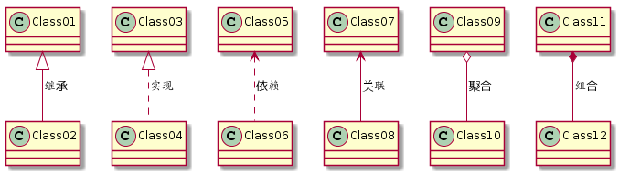

### 类图关系

- **泛化(generalization)**：表示is-a的关系，是对象之间耦合度最大的一种关系，子类继承父类的所有细节。直接使用语言中的继承表达。**带三角箭头的实线表示，箭头从子类指向父类**

  

- **实现(Realization)**: 在类图中就是接口和实现的关系。**三角箭头的虚线表示，箭头从实现类指向接口。**

  

- **依赖(Dependency)**：是临时性的关联。代码中一般指由局部变量、函数参数、返回值建立的对于其他对象的调用关系。一个类调用被依赖类中的某些方法而得以完成这个类的一些职责。**带箭头的虚线表示，箭头从使用类指向被依赖的类**

  

- **关联(Association) **: 对象之间一种引用关系，比如客户类与订单类之间的关系。这种关系通常使用类的属性表达。关联又分为一般关联、聚合关联与组合关联。后两种在后面分析。**使用带箭头的实线表示，箭头从使用类指向被关联的类。可以是单向和双向。**

  

- **聚合(Aggregation)**：表示has-a的关系，是一种不稳定的包含关系。较强于一般关联,有整体与局部的关系,并且没有了整体,局部也可单独存在。如公司和员工的关系，公司包含员工，但如果公司倒闭，员工依然可以换公司。在**类图使用空心的菱形表示，菱形从局部指向整体**

  

- **组合(Composition)** ：表示contains-a的关系，是一种强烈的包含关系。组合类负责被组合类的生命周期。是一种更强的聚合关系。部分不能脱离整体存在。如公司和部门的关系，没有了公司，部门也不能存在了；**在类图使用实心的菱形表示，菱形从局部指向整体。**


### PUML 图形

```uml
@startuml
Class01  <|--  Class02  : 继承
Class03  <|..  Class04  : 实现
Class05  <..   Class06  : 依赖
Class07  <--   Class08  : 关联
Class09  o--   Class10  : 聚合
Class11  *--   Class12  : 组合
@enduml
```




####  [PUML 图像网站](https://plantuml.com/zh/class-diagram)

